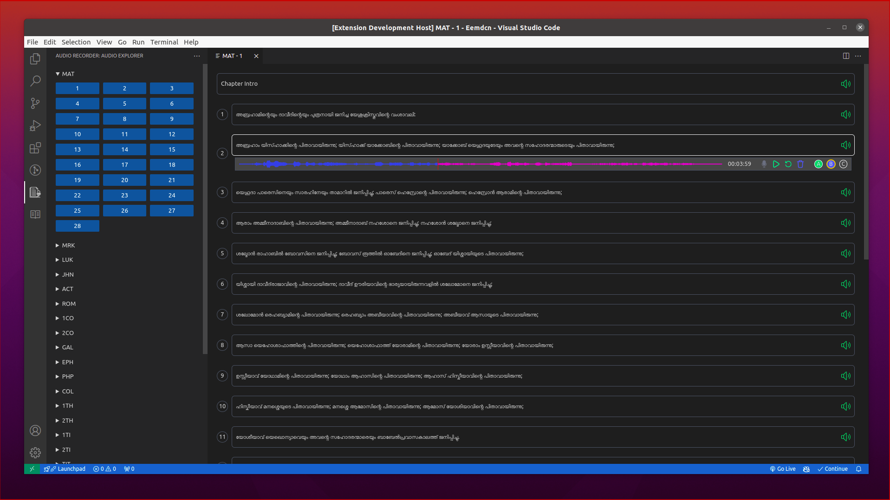

## Scribe Audio Extension 🎙

---

The objective of Scibe Audio Eextension is to provide audio recording features in Visual Studio Code. This extension allows users to record audio clips straight from the editor for translation purposes.

### Main Features

---

- Audio recording by using system microphone 🎙
- Simple controls to Play ▶, Stop ⏹, Pause ⏸ and Rewind (Restart) ↺ recordings.
- Delete 🗑 option to delete the recorded audio.



### Prerequisites

---

- Node.js
- Visual Studio Code
- Install ffmpeg and fluent-ffmpeg by using the below commands:-

  ```
  sudo apt install ffmpeg
  ```

  ```
  npm install fluent-ffmpeg
  ```

### Future Enhancemnets

---

1. Export Feature
   - Verse Level Export
   - Chapter Level Export (with Timestamp)
2. Audio Conversion
3. Merge Multiple Audios
4. Record audio with multiple takes

**Enjoy!**
